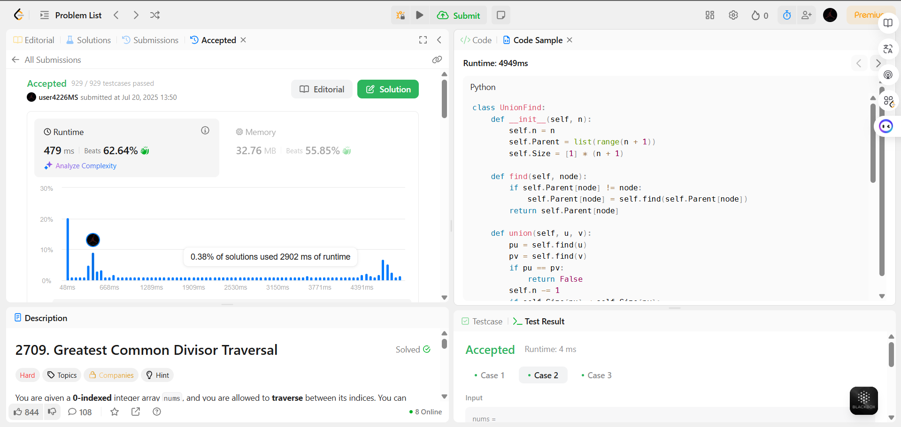

# Exercícios do Leetcode sobre Greedy Algorithms

**Conteúdo da Disciplina**: Algoritmos Gulosos (Greedy) 

## Alunos
|Matrícula | Aluno |
| -- | -- |
| 20/0059980  | Pedro Miguel Martins de Oliveira dos Santos |
| 21/1062910  |  Daniel Nunes Duarte |

## Sobre 

Nesse projeto resolvemos quatro questões do tema Greedy:

- A primeira questão é a 2406 de nível difícil, que pode ser encontrada em [Questão 2406 - Difícil](https://leetcode.com/problems/divide-intervals-into-minimum-number-of-groups/description/). Ela trata sobre dividir intervalos em grupos mínimos, resolvida em Python.

- A segunda questão é a 2454 de nível difícil, disponível em [Questão 2454 - Difícil](https://leetcode.com/problems/next-greater-element-iv/description/). O desafio consiste em encontrar o segundo maior elemento à direita de cada posição, resolvida em Python.

- A terceira questão é a 556 de nível médio, disponível em [Questão 556 - Média](https://leetcode.com/problems/next-greater-element-iii/description/). O objetivo é encontrar o próximo maior número possível com os mesmos dígitos, resolvida em Python.

- A quarta questão é a 2709 de nível difícil, disponível em [Questão 2709 - Difícil](https://leetcode.com/problems/greatest-common-divisor-traversal/description/). O objetivo é verificar se é possível percorrer todos os pares de números do array onde o GCD de cada par é maior que 1, resolvida em Python.

## Screenshots

### Questão 2406
#### Hard

---
### Questão 2454
#### Hard

---
### Questão 556
#### Medium

---
### Questão 2709
#### Hard

---

## Instalação 
**Linguagem**: Python 

## Uso 

1. Para utilizar as soluções, basta encontrar o código da questão desejada no repositório e copiar.
2. Abra o site da questão referente no LeetCode e cole o código no campo "code" dentro da página.
3. Para realizar a execução e teste, aperte o botão "play" na página ao lado do botão "submit".

Obs.: Necessário estar logado na página LeetCode.

